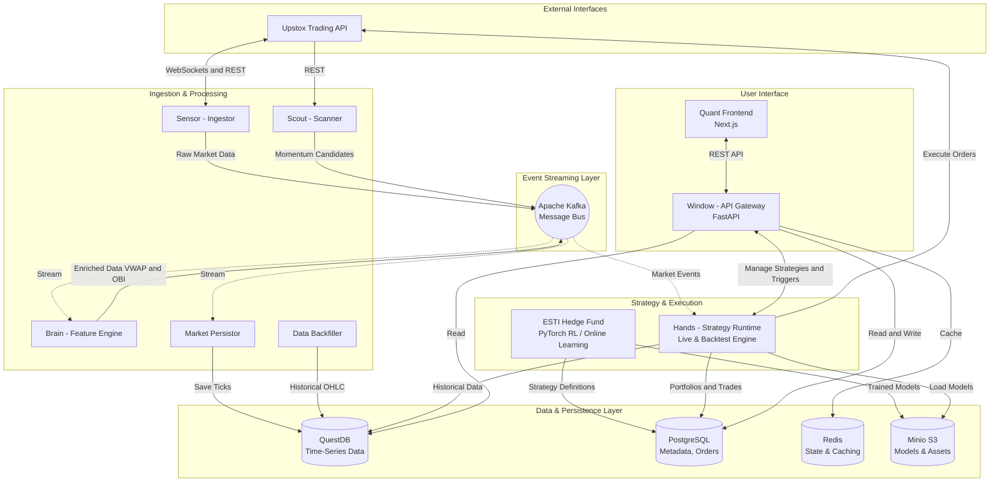

# Production-Grade Quant Trading Platform (Indian Markets)

A **high-frequency, event-driven algorithmic trading platform** designed for **NSE/BSE (India)** using the **Upstox V3 API**.

Built with a **microservices architecture**, it handles real-time ingestion, market microstructure analysis (VWAP, Order Book Imbalance), and automated execution — all while staying within **Upstox free-tier API limits**.

---

## Architecture

The system follows a **reactive, event-driven design**.



| Layer | Component | Technology | Purpose |
|------|----------|-----------|---------|
| 1 | Scout | Market Scanner (Python) | Scans 100+ stocks every 5 mins to find high-momentum breakout candidates |
| 2 | Sensor | Ingestor (Upstox V3 / Protobuf) | WebSocket ingestion & dynamic subscriptions |
| 3 | Bus | Message Bus (Apache Kafka) | Low-latency streaming of ticks, greeks, and signals |
| 4 | Storage | Time-Series DB (QuestDB) | Stores ticks, OHLC, and option greeks |
| 4 | Storage | Relational DB (PostgreSQL) | Instrument master, user metadata, trade logs |
| 5 | Brain | Feature Engine (Pandas / NumPy) | VWAP, OBI, Spread, Aggressor detection |
| 6 | Hands | Strategy Runtime (Python) | Executes trades (Paper / Live) |
| 7 | Window | API Gateway (FastAPI) | REST API for dashboards and clients |

---

## ⚡ Quick Start

### Prerequisites
- Docker Desktop (minimum **6 GB RAM** allocated)
- Upstox API Credentials (API Key & Secret)

### One-Click Production Install (No Build Required)
Run the following in your terminal to download the production manifest, configure your API keys, and start the pre-built GHCR images:

```bash
mkdir kira-platform && cd kira-platform
curl -O https://raw.githubusercontent.com/suprathps/quant-platform/main/docker-compose.prod.yml
curl -o .env https://raw.githubusercontent.com/suprathps/quant-platform/main/services/ingestion/.env.example
# Edit .env with your Upstox API keys
docker compose -f docker-compose.prod.yml up -d
```

### Developer Installation (Build from Source)
Clone repository and prepare environment:
```bash
git clone https://github.com/suprathps/quant-platform.git
cd quant-platform
cp services/ingestion/.env.example .env
docker compose -f infra/docker-compose.yml up -d --build
```

### Configuration (`services/ingestion/.env`)

UPSTOX_API_KEY=your_api_key  
UPSTOX_API_SECRET=your_api_secret  
UPSTOX_REDIRECT_URI=http://localhost:8501  
UPSTOX_ACCESS_TOKEN= *(leave blank initially)*  

KAFKA_BOOTSTRAP_SERVERS=kafka_bus:9092  
POSTGRES_HOST=postgres_metadata  
QUESTDB_HOST=questdb_tsdb  

---

##  Daily Routine (Runbook)

 **Upstox access tokens expire daily at 3:30 AM IST**  
Follow this routine every trading day before market open (~08:45 AM).

### Step 1: Start Infrastructure
- `cd infra`
- `docker compose up -d`

### Step 2: Authenticate (Generate Daily Token)
- `docker compose run --rm ingestor python auth_helper.py`
- Login via browser, copy auth code, paste into terminal
- Update `UPSTOX_ACCESS_TOKEN` in `.env`

### Step 3: Sync Instrument Master (IPOs / Expiries)
Downloads ~22,000 instruments into PostgreSQL.
- `docker exec -it api_gateway python sync_instruments.py`

### Step 4: Launch Application Services
- `docker compose restart ingestor scanner feature_engine`

### Step 5: Verify System Health
- `docker compose run --rm doctor`

---

##  Kafka Topics & Data Streams

### Raw Market Data (`market.equity.ticks`)
Fields: symbol, ltp, volume, open interest, previous close, timestamp

### Option Greeks (`market.option.greeks`)
Fields: iv, delta, gamma, theta, vega

### Enriched Microstructure (`market.enriched.ticks`)
Fields: vwap, order book imbalance, spread, aggressor side

### Scanner Suggestions (`scanner.suggestions`)
List of high-momentum equities detected pre-breakout

---

---

##  Quant SDK & Strategy Engine

The platform now features a **QuantConnect-inspired SDK** (`quant_sdk`) for writing and executing algorithms. Strategies are decoupled from the core runtime, allowing for flexible backtesting and live execution.

### 1. Writing a Strategy
Inherit from `QCAlgorithm` and implement `Initialize` and `OnData`.

```python
from quant_sdk import QCAlgorithm, Resolution

class MyStrategy(QCAlgorithm):
    def Initialize(self):
        self.SetCash(100000)
        self.SetStartDate(2024, 1, 1)
        self.SetEndDate(2024, 12, 31)
        
        # Subscribe to Data
        self.symbol = "NSE_EQ|INE002A01018"
        self.AddEquity(self.symbol, Resolution.Minute)
        
        # Define Indicators
        self.sma = self.SMA(self.symbol, 20, Resolution.Minute)

    def OnData(self, data):
        # Access Data
        bar = data[self.symbol]
        
        # Trading Logic
        if not self.Portfolio[self.symbol].Invested:
            if bar.Close > self.sma.Value:
                self.SetHoldings(self.symbol, 1.0) # 100% Allocation
        
        elif bar.Close < self.sma.Value:
            self.Liquidate(self.symbol)
```

### 2. SDK Reference
| Method | Description |
| :--- | :--- |
| `Initialize()` | Setup implementation. Define cash, start/end dates, and subscriptions. |
| `OnData(slice)` | Event handler for new data ticks/bars. |
| `AddEquity(symbol, resolution)` | Subscribe to a stock. |
| `SMA(symbol, period)` | Register a Simple Moving Average indicator. |
| `SetHoldings(symbol, percent)` | Rebalance portfolio to target percentage (0.0 - 1.0). |
| `Liquidate(symbol)` | Close all positions for a symbol. |

### 3. Running Backtests
Run a backtest using Docker Compose. The `AlgorithmEngine` automatically loads the strategy and feeds it historical data from the `Replayer`.

```bash
# Run Backtest with specific Strategy and Run ID
docker compose run --rm \
  -e BACKTEST_MODE=true \
  -e RUN_ID=my_test_run \
  -e STRATEGY_NAME=strategies.demo_algo.DemoStrategy \
  strategy_runtime python main.py
```

### 4. Backtest Reports
Results (Order History, Equity Curve) are saved to PostgreSQL tables:
- `backtest_portfolios`
- `backtest_orders`
- `backtest_positions`

Visualize results using the **Frontend Dashboard**.

---

##  API Documentation

**Base URL:** http://localhost:8080

### Get Live Quote
- `GET /api/v1/market/quote/{symbol}`

### Get Option Greeks
- `GET /api/v1/market/greeks/{symbol}`

### Get Trade History
- `GET /api/v1/trades?limit=50`

### Search Instruments
- `GET /api/v1/instruments/search?query=<text>`

---

## 🛠 Developer Utilities

### Data Backfiller
Downloads historical 1-minute OHLCV data for backtesting.
- Configure parameters in `services/backfiller/main.py`
- Run: `docker compose run --rm backfiller`

### System Doctor
Runs diagnostics on Kafka, databases, and API connectivity.
- `docker compose run --rm doctor`

---

##  Database Schema

### PostgreSQL (`quant_platform`)
- instruments — master symbol dictionary
- executed_orders — audit trail of trades
- users — authentication and profile data

### QuestDB (`qdb`)
- ticks — price, volume, spread, aggressor
- option_greeks — IV, delta, gamma
- ohlc — 1-minute historical candles

---

##  Troubleshooting

### Kafka Connection Refused
Kafka takes ~30s to boot on macOS.  
Restart ingestor if needed.

### HTTP 401 Unauthorized
Token expired — rerun authentication helper.

### Topic Not Found
Topics auto-create; if failure occurs, run system doctor.

## 👤 Author
Suprath PS
