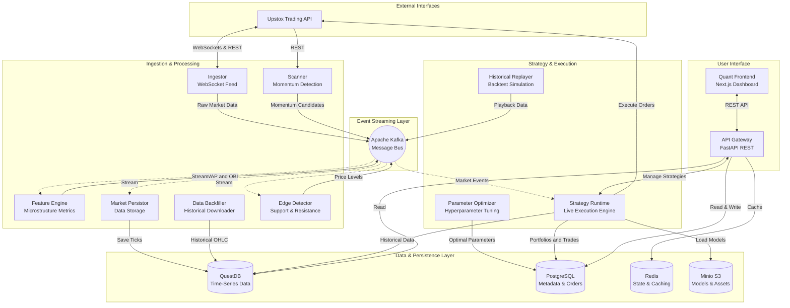

# KIRA - Quantitative Trading Platform

A high-frequency, event-driven algorithmic trading platform designed for the Indian equity markets using the Upstox API.

Built with a sophisticated microservices architecture, KIRA handles real-time data ingestion, market microstructure analysis (such as Volume Weighted Average Price and Order Book Imbalance), dynamic support and resistance detection, and automated execution. It is designed to be highly scalable while remaining compliant with standard brokerage API rate limits.

---

## Quick Start

You can deploy the entire production-ready platform with a single command. 

Ensure you have Docker Desktop installed with at least 8 GB of RAM allocated, and your Upstox Developer API Credentials ready.

```bash
mkdir kira && cd kira
curl -O https://raw.githubusercontent.com/suprathps/kira/master/docker-compose.prod.yml
curl -o .env https://raw.githubusercontent.com/suprathps/kira/master/services/ingestion/.env.example

# Open the .env file in your editor and add your Upstox API keys
docker compose -f docker-compose.prod.yml up -d
```

Once the containers have initialized, you can access the trading dashboard by navigating to `http://localhost:3000` in your web browser.

---

## Architecture Overview

The system strictly adheres to a reactive, event-driven design built around an Apache Kafka message bus. This allows individual components to scale independently and prevents network bottlenecks during highly volatile market sessions.



---

## Core Microservices

The platform is divided into specialized, isolated microservices that communicate predominantly over Kafka to ensure deep decoupling and minimum latency.

### 1. Ingestor
Connects directly to the Upstox V3 WebSocket feed. It subscribes to a dynamic list of instruments, including the top 100 highly liquid NSE equities globally recognized in the NIFTY index, and publishes raw tick data (Last Traded Price, Volume, Open Interest, and Level 2 Market Depth) directly to Kafka.

### 2. Market Scanner
Operates on a scheduled interval to scan the broader market for high-momentum breakout candidates. It calculates momentum scores based on price action and trading volume, alerting the Ingestor to dynamically subscribe to new, highly-active symbols.

### 3. Feature Engine
Consumes the raw market ticks from Kafka and calculates enriched technical indicators in real-time. This includes Volume-Weighted Average Price, Order Book Imbalance, and short-term Simple Moving Averages. The enriched data stream is then republished back to the event bus for downstream execution elements.

### 4. Edge Detector
A real-time analytics module that listens to the market feed and mathematically computes dynamic local support and resistance levels. It constantly maps out the structural boundaries of the market, helping algorithmic strategies identify optimal entry and exit edges based on recent price consolidation zones.

### 5. Market Persistor
Listens to all enriched market data passing through Kafka and heavily batches it for insertion into QuestDB, an ultra-fast time-series database. This ensures every single tick, quote, and calculated metric is safely and efficiently stored for long-term historical analysis.

### 6. Strategy Runtime (Algorithm Engine)
The core execution environment. This service loads trading strategies built using the native Quant SDK. It handles everything from evaluating live market signals and managing the portfolio, to strictly sizing positions and tracking daily risk compliance. It interfaces securely with the Upstox API to submit live market orders, or routes them through an internal virtual paper exchange simulator.

### 7. Parameter Optimizer
A background service responsible for continuous hyperparameter tuning. It performs grid searches across historical datasets to find the most mathematically optimal parameters (such as trailing stop-loss percentages or momentum thresholds) for active strategies, adjusting them as market regimes change.

### 8. Historical Replayer & Data Backfiller
The Data Backfiller strictly downloads historical OHLCV data from the Upstox API while elegantly managing rigorous rate limits. The Historical Replayer is then able to stream this stored historical data back into the main Kafka bus at expedited speeds, mimicking a live market and allowing for extremely accurate, event-driven time-series backtesting.

### 9. API Gateway
A robust FastAPI REST interface that acts as the secure bridge between the internal cluster and external applications. It handles routing and caching (via Redis) for real-time portfolio metrics, historical chart data, strategy management, and live performer leaderboards.

### 10. Quant Frontend
A sleek Next.js resilient dashboard providing a graphical interface for the platform. It visualizes scanner results, active portfolio positions, live equity curves, and allows users to manually backtest custom strategies or transition them cleanly into live execution.

### 11. System Doctor
A comprehensive diagnostics utility that continuously monitors the health of the Kafka broker, the databases, and broker API connectivity, ensuring the platform remains completely stable throughout the volatile trading day.

---

## Database Infrastructure

The persistence layer is intentionally fragmented based on distinct optimization requirements:

- **QuestDB**: Optimized for millions of rows of high-frequency time-series data. Stores all raw ticks, historical OHLC candles, option greeks, and microstructure metrics.
- **PostgreSQL**: Acts as the relational state store. Manages user authentication, instrument metadata mappings, strategy definitions, portfolio balances, active positions, and the comprehensive audit trail of all executed orders.
- **Redis**: Provides fast, ephemeral caching for the API Gateway and connection limit management.
- **Minio S3**: Object storage designated to save trained machine learning models, persistent strategy state files, and routine system backups.

---

## Writing a Strategy

The platform provides a flexible SDK for implementing quantitative logic inside the Strategy Runtime. 

```python
from quant_sdk import QCAlgorithm, Resolution

class MomentumStrategy(QCAlgorithm):
    def Initialize(self):
        self.SetCash(20000)
        self.symbol = "NSE_EQ|INE002A01018"
        self.AddEquity(self.symbol, Resolution.Minute)
        self.sma = self.SMA(self.symbol, 20, Resolution.Minute)

    def OnData(self, data):
        bar = data[self.symbol]
        
        # Determine trend and allocate portfolio sizing
        if not self.Portfolio[self.symbol].Invested:
            if bar.Close > self.sma.Value:
                self.SetHoldings(self.symbol, 1.0) 
        elif bar.Close < self.sma.Value:
            self.Liquidate(self.symbol)
```

---

## Disclaimer
This software is for educational, quantitative research, and informational purposes only. Do not risk money which you are afraid to lose. USE THE SOFTWARE AT YOUR OWN RISK. THE AUTHORS AND ALL AFFILIATES ASSUME NO RESPONSIBILITY FOR YOUR TRADING RESULTS.
